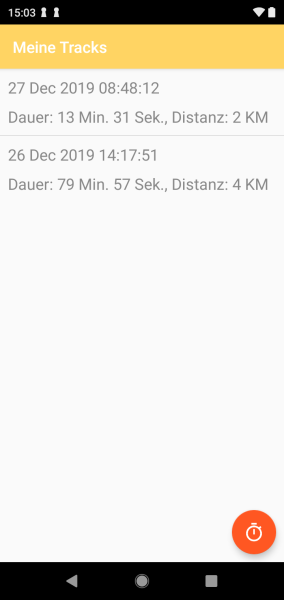

# Track Me
Laufen, Wandern oder Radfahren - egal was Sie gerne machen, verfolgen Sie mit der kostenlosen "Track Me"
Fitness-App alle ihre sportlichen Aktivitäten. Die Aufzeichnung ihrer Tranings und das übersichtliche Sporttagebuch
unterstützen Sie dabei ihre Ziele zu erreichen!

## Funktionen
### Sporttagebuch
- Mithilfe des Sporttagebuchs haben Sie stets einen Überblick über ihre bereits absolvierten Trainings
- Einzelne Aktivitäten können Sie auf einer übersichtlichen Kartenansicht darstellen lassen

### Aufzeichnen sportlicher Aktivitäten
- Eine neue Aktivität kann jederzeit aus dem Sporttagebuch heraus gestartet werden
- Während des aufzeichnens einer sportlichen Aktivität werden die aktuellen Trainingsdaten übersichtlich dargestellt

## Teammitglieder
- Amann Lukas - Koordination
- Auderer Andreas - Entwicklung
- Berchtold Thomas - Logo und Design
- Eberle Harald - Entwicklung
- Engstler Christian - Testing und Recherche
- Gumilar Manfred - Entwicklung
- Stuchly Oliver - Testing und Recherche