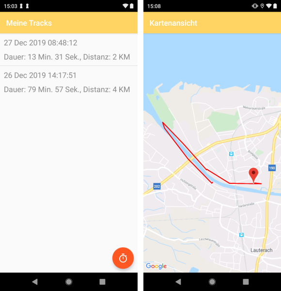
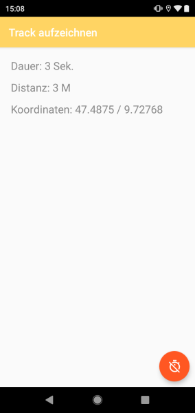

# Track Me
Aufgabenstellung: App sollte die Distanz zwischen Start- und Endpunkt berechnen. 
- Nicht Genügend: App lässt sich nicht öffnen oder bietet keine Funktionalität.
- Genügend: App lässt sich öffnen und bietet geringe Funktionalität.
- Befriedigend: Aktivitäten lassen sich aufzeichnen.
- Gut: Aktivitäten lassen sich aufzeichnen und speichern. Im Tagebuch werden alle getätigten Aktivitäten archiviert. Über einen Klick auf dir jeweilige Aktivität gelangt man in eine Detailansicht.
- Sehr Gut: Aktivitäten werden zusätzlich auf einer Karte dargestellt. App überzeugt durch gut strukturierten Source Code und übersichtliche Layouts.

## Funktionen

## Teammitglieder
- Amann Lukas
- Auderer Andreas
- Berchtold Thomas
- Eberle Harald
- Engstler Christian
- Gumilar Manfred
- Stuchly Oliver